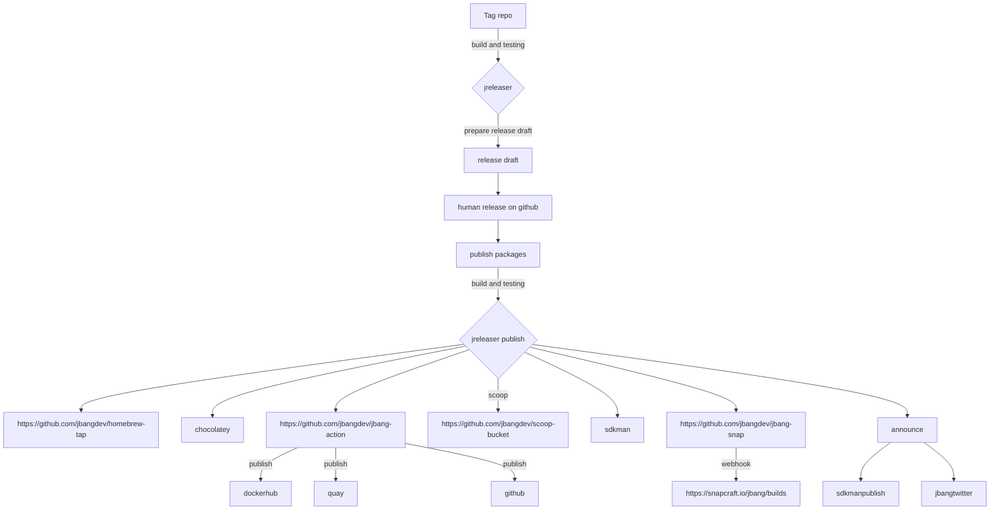

# How JBang is released

Short overview on how JBang is built/released.

```mermaid
graph TD
	tag[Tag repo] -->|build and testing| jreleaser{jreleaser}
	jreleaser -->|prepare release draft| draft[release draft]
	draft -->humanrelease[human release on github]
	humanrelease --> publishpackages[publish packages]
	publishpackages -->|build and testing| publish{jreleaser publish}
	publish --> brew[https://github.com/jbangdev/homebrew-tap]
	publish --> chocolatey
	publish --> docker[https://github.com/jbangdev/jbang-action]
	publish --> |scoop| scoop[https://github.com/jbangdev/scoop-bucket]
	publish --> sdkman
	publish --> snap[https://github.com/jbangdev/jbang-snap]
	publish --> announce
	announce --> sdkmanpublish
	announce --> jbangtwitter
	snap -->|webhook| snaprepo[https://snapcraft.io/jbang/builds]
	docker --> |publish| dockerhub
	docker --> |publish| quay
	docker --> |publish| github

```
